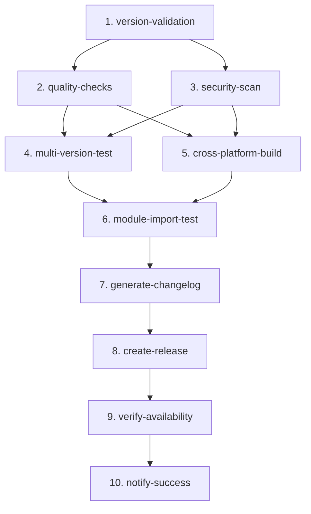

# Release Process

This document describes the automated release process for the Instana Go Client library.

## Overview

The release process is fully automated through GitHub Actions and ensures every release meets high quality and security standards before being published.

## Release Workflow

### Trigger a Release

**Option 1: Tag-based Release (Recommended)**
```bash
# Create and push a version tag
git tag v1.0.0
git push origin v1.0.0
```

**Option 2: Manual Workflow Dispatch**
1. Go to Actions → Instana Go Client Release
2. Click "Run workflow"
3. Enter version (e.g., v1.0.0)
4. Click "Run workflow"

### Automated Pipeline

Once triggered, the release goes through 10 sequential jobs:



## Pipeline Jobs

### 1. Version Validation
**Purpose**: Validate release version and prerequisites

**Checks**:
- ✅ Semver format validation (v1.2.3, v1.2.3-beta.1)
- ✅ Tag doesn't already exist
- ✅ Clean working directory
- ✅ Version comparison with last release

**Duration**: ~30 seconds

---

### 2. Quality Checks
**Purpose**: Comprehensive code quality validation

**Checks**:
- ✅ golangci-lint (using `.golangci.yml` config)
- ✅ Tests with race detector
- ✅ Code coverage (80% minimum threshold)
- ✅ go.mod/go.sum tidiness
- ✅ Code formatting (gofmt)

**Duration**: ~2-3 minutes

---

### 3. Security Scan
**Purpose**: Identify security vulnerabilities

**Checks**:
- ✅ govulncheck for known CVEs
- ✅ Dependency security advisories
- ✅ High-severity issue detection

**Duration**: ~1-2 minutes

---

### 4. Multi-Version Testing
**Purpose**: Ensure Go version compatibility

**Matrix**: Tests on Go 1.23 (minimum required version from go.mod)

**Checks**:
- ✅ Full test suite on required version
- ✅ Build verification
- ✅ Compatibility with minimum Go version

**Duration**: ~2-3 minutes

**Note**: Only tests on Go 1.23 as specified in go.mod. When newer Go versions are released (e.g., 1.24), consider adding them to test forward compatibility.

---

### 5. Cross-Platform Build
**Purpose**: Verify cross-platform compatibility

**Matrix**:
- Linux (amd64, arm64)
- macOS (amd64, arm64)
- Windows (amd64)

**Checks**:
- ✅ Build for each OS/architecture
- ✅ Platform-specific error detection

**Duration**: ~2-3 minutes (parallel)

---

### 6. Module Import Test
**Purpose**: Verify module can be imported

**Checks**:
- ✅ Module path validation
- ✅ Import structure verification
- ✅ Compilation test

**Duration**: ~30 seconds

---

### 7. Generate CHANGELOG
**Purpose**: Auto-generate CHANGELOG entry

**Process**:
1. Extracts commits since last tag
2. Formats with PR links (no user attribution)
3. Generates version section
4. Prepends to CHANGELOG.md
5. Commits and pushes changes

**Output Format**:
```markdown
## [v1.0.0](https://github.com/instana/instana-go-client/tree/v1.0.0) (2026-03-19)

[Full Changelog](https://github.com/instana/instana-go-client/compare/v0.9.0...v1.0.0)

**Changes:**

- Add new configuration builder pattern [\#45](https://github.com/instana/instana-go-client/pull/45)
- Fix race condition in rate limiter [\#43](https://github.com/instana/instana-go-client/pull/43)
```

**Duration**: ~1 minute

---

### 8. Create Release
**Purpose**: Create GitHub release

**Process**:
1. Extracts release notes from CHANGELOG.md
2. Adds installation instructions
3. Creates GitHub release
4. Attaches documentation files
5. Marks pre-release if applicable

**Duration**: ~30 seconds

---

### 9. Verify Availability
**Purpose**: Confirm module availability

**Checks**:
- ✅ Triggers Go proxy (proxy.golang.org)
- ✅ Verifies module availability (5 retries)
- ✅ Checks pkg.go.dev documentation

**Duration**: ~1-2 minutes

---

### 10. Notify Success
**Purpose**: Report release status

**Output**:
- ✅ Release completion status
- 📦 Module installation command
- 🔗 Release URL
- 📚 Documentation URL

**Duration**: ~10 seconds

---

## Total Pipeline Duration

**Estimated Time**: 8-12 minutes

**Breakdown**:
- Validation & Quality: 3-4 minutes
- Testing (parallel): 3-4 minutes
- CHANGELOG & Release: 2-3 minutes
- Verification: 1-2 minutes

## Version Naming Convention

Follow [Semantic Versioning](https://semver.org/):

### Format
```
v<MAJOR>.<MINOR>.<PATCH>[-<PRERELEASE>][+<BUILD>]
```

### Examples
- **Stable Release**: `v1.0.0`, `v2.1.3`
- **Pre-release**: `v1.0.0-alpha.1`, `v1.0.0-beta.2`, `v1.0.0-rc.1`
- **Build Metadata**: `v1.0.0+build.123`

### When to Increment

**MAJOR** (v1.0.0 → v2.0.0)
- Breaking API changes
- Incompatible changes

**MINOR** (v1.0.0 → v1.1.0)
- New features (backwards-compatible)
- New functionality

**PATCH** (v1.0.0 → v1.0.1)
- Bug fixes (backwards-compatible)
- Security patches

## Developer Workflow

### During Development

1. **Make changes and commit**
   ```bash
   git commit -m "Add new configuration builder pattern (#45)"
   git commit -m "Fix race condition in rate limiter (#43)"
   ```

2. **Create Pull Request**
   - Use descriptive PR title
   - PR number will be automatically included in CHANGELOG

3. **Merge to main**
   ```bash
   git checkout main
   git pull origin main
   ```

### Creating a Release

1. **Ensure main branch is up to date**
   ```bash
   git checkout main
   git pull origin main
   ```

2. **Create and push tag**
   ```bash
   # For stable release
   git tag v1.0.0
   git push origin v1.0.0
   
   # For pre-release
   git tag v1.0.0-beta.1
   git push origin v1.0.0-beta.1
   ```

3. **Monitor workflow**
   - Go to Actions tab in GitHub
   - Watch "Instana Go Client Release" workflow
   - All jobs should complete successfully

4. **Verify release**
   - Check GitHub Releases page
   - Verify CHANGELOG.md updated
   - Test module installation:
     ```bash
     go get github.com/instana/instana-go-client@v1.0.0
     ```

## CHANGELOG Management

### Automatic Generation

The CHANGELOG.md is **automatically generated** during release:

1. **Commits are collected** since last tag
2. **PR numbers are extracted** from commit messages
3. **CHANGELOG section is generated** with links
4. **File is updated** and committed automatically

### Format

```markdown
## [v1.0.0](https://github.com/instana/instana-go-client/tree/v1.0.0) (2026-03-19)

[Full Changelog](https://github.com/instana/instana-go-client/compare/v0.9.0...v1.0.0)

**Changes:**

- Description of change [\#PR_NUMBER](PR_URL)
```

### No Manual Editing Required

- ✅ Developers only commit code
- ✅ CHANGELOG is auto-generated on release
- ✅ Format is consistent across releases
- ✅ PR attribution is automatic

## Quality Gates

Every release must pass these gates:

### Code Quality
- ✅ All linter checks pass
- ✅ Code coverage ≥ 80%
- ✅ All tests pass with race detector
- ✅ Code is properly formatted

### Security
- ✅ No known vulnerabilities (govulncheck)
- ✅ No high-severity security issues
- ✅ Dependencies are secure

### Compatibility
- ✅ Works on Go 1.21, 1.22, 1.23
- ✅ Builds on Linux, macOS, Windows
- ✅ Supports amd64 and arm64 architectures

### Module Integrity
- ✅ Module can be imported
- ✅ go.mod and go.sum are valid
- ✅ Available on Go proxy

## Troubleshooting

### Release Failed at Quality Checks

**Problem**: Linter errors or test failures

**Solution**:
```bash
# Run locally before releasing
golangci-lint run
go test -v -race ./...
```

### Release Failed at Security Scan

**Problem**: Vulnerabilities detected

**Solution**:
```bash
# Check vulnerabilities locally
go install golang.org/x/vuln/cmd/govulncheck@latest
govulncheck ./...

# Update dependencies
go get -u ./...
go mod tidy
```

### Release Failed at Coverage Check

**Problem**: Coverage below 80%

**Solution**:
```bash
# Check coverage locally
go test -coverprofile=coverage.out ./...
go tool cover -func=coverage.out

# Add more tests to increase coverage
```

### Tag Already Exists

**Problem**: Version tag already exists

**Solution**:
```bash
# Delete local tag
git tag -d v1.0.0

# Delete remote tag (use with caution!)
git push origin :refs/tags/v1.0.0

# Create new tag with incremented version
git tag v1.0.1
git push origin v1.0.1
```

### Module Not Available on Go Proxy

**Problem**: Module not immediately available after release

**Solution**:
- Wait 5-10 minutes for proxy propagation
- Manually trigger: `GOPROXY=https://proxy.golang.org go get github.com/instana/instana-go-client@v1.0.0`
- Check status: `curl https://proxy.golang.org/github.com/instana/instana-go-client/@v/v1.0.0.info`

## Best Practices

### Before Release

1. ✅ Ensure all PRs are merged
2. ✅ Run tests locally
3. ✅ Check for uncommitted changes
4. ✅ Verify version number follows semver

### During Release

1. ✅ Monitor workflow progress
2. ✅ Check for any failures
3. ✅ Review generated CHANGELOG
4. ✅ Verify release notes

### After Release

1. ✅ Test module installation
2. ✅ Check pkg.go.dev documentation
3. ✅ Verify CHANGELOG.md updated
4. ✅ Announce release (if needed)

## Release Checklist

- [ ] All changes merged to main
- [ ] Tests passing locally
- [ ] No uncommitted changes
- [ ] Version number decided (semver)
- [ ] Tag created and pushed
- [ ] Workflow completed successfully
- [ ] CHANGELOG.md updated
- [ ] GitHub release created
- [ ] Module available on Go proxy
- [ ] Documentation on pkg.go.dev

## Support

For issues with the release process:

1. Check workflow logs in GitHub Actions
2. Review this documentation
3. Check troubleshooting section
4. Open an issue if problem persists

## References

- [Semantic Versioning](https://semver.org/)
- [Go Modules Reference](https://go.dev/ref/mod)
- [GitHub Actions Documentation](https://docs.github.com/en/actions)
- [golangci-lint](https://golangci-lint.run/)
- [govulncheck](https://pkg.go.dev/golang.org/x/vuln/cmd/govulncheck)